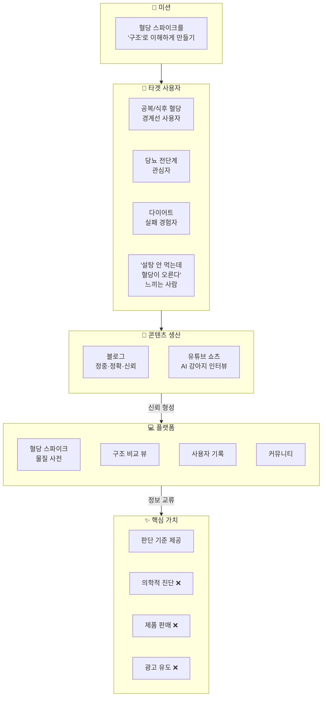
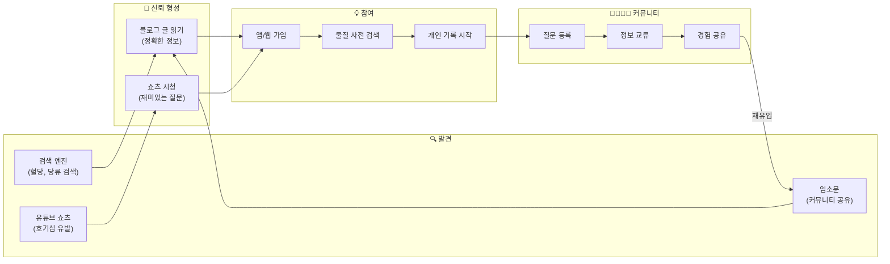
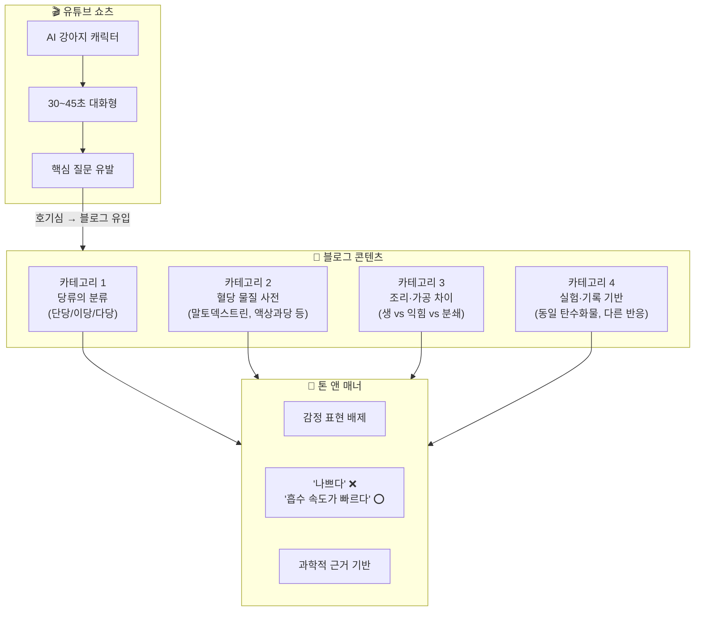
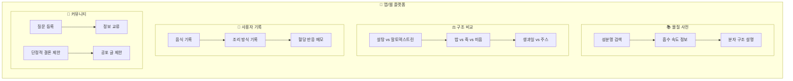
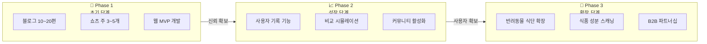
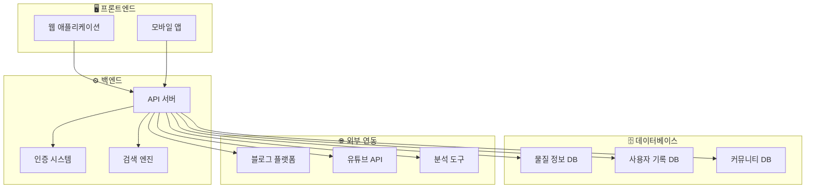
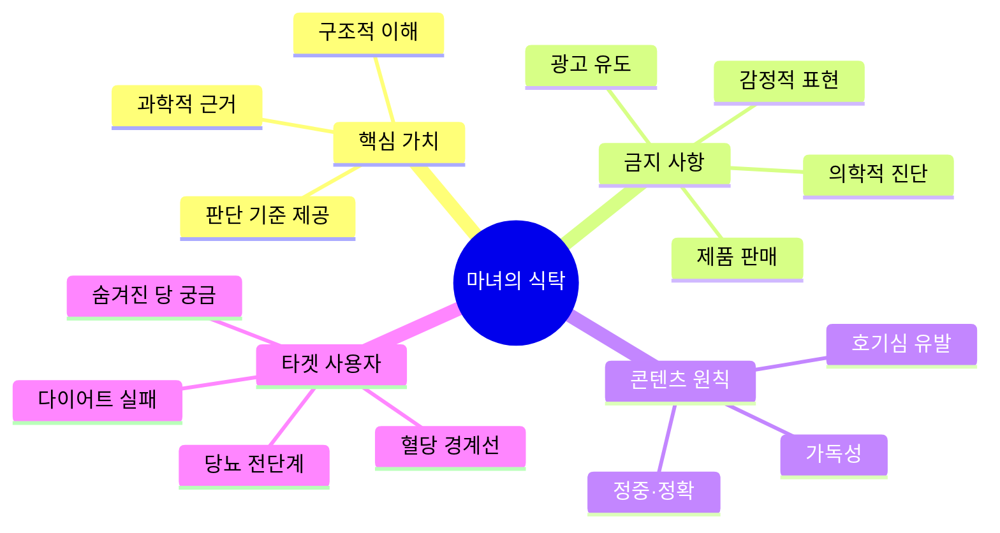

# 마녀의 식탁 (Witch's Table) 프로젝트 순서도

## 1. 전체 비즈니스 흐름도

---

## 2. 사용자 유입 흐름도

---

## 3. 콘텐츠 제작 프로세스

---

## 4. 앱/웹 기능 구조도

---

## 5. 개발 로드맵 (Phase별)

---

## 6. 전체 시스템 아키텍처

---

## 7. 핵심 원칙 요약

---

> **참고**: 이 순서도들은 Mermaid 문법으로 작성되어 GitHub, Notion, Obsidian 등에서 바로 렌더링됩니다.
